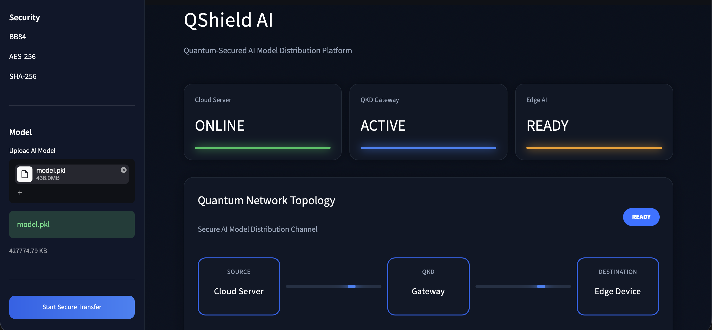
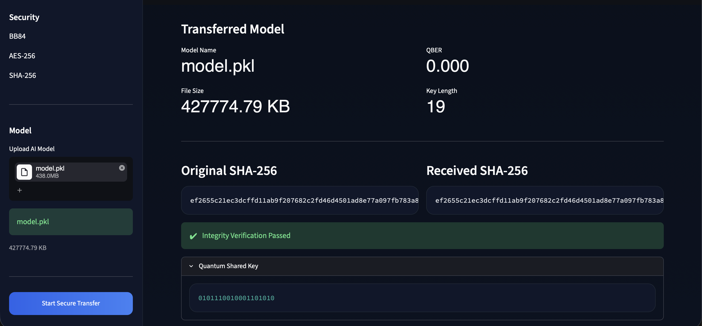
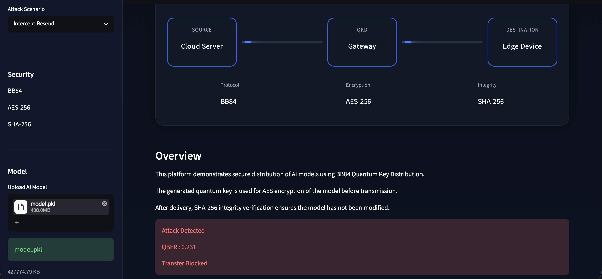

# Quantum-Secured AI Model Distribution Framework
> **Quantum-Secured AI Model Distribution Framework** is a cybersecurity project that demonstrates secure deployment of AI models using BB84 Quantum Key Distribution, AES-256 encryption, and SHA-256 integrity verification. The framework supports user-uploaded AI models and simulates secure end-to-end deployment from a Cloud Server to an Edge Device through an interactive Streamlit dashboard.
---

> **Dashboard Screenshot will be added here**

---

## Overview

This project demonstrates how AI models can be securely deployed from a cloud server to an edge device using quantum-inspired cryptographic techniques.

The framework simulates a complete secure deployment pipeline by combining:

- BB84 Quantum Key Distribution for secure session key generation
- AES-256 encryption for protecting AI model files during transmission
- SHA-256 hashing for integrity verification
- Attack simulation using Quantum Bit Error Rate (QBER)
- Secure deployment to an Edge Device

The application supports user-uploaded AI models and provides a real-time Streamlit dashboard that visualizes the complete deployment workflow.

## Key Features

- Secure AI model distribution using BB84 Quantum Key Distribution
- AES-256 encryption for protecting model parameters
- SHA-256 integrity verification
- Upload and securely transfer custom AI models
- Support for PyTorch, ONNX, and Scikit-Learn models
- Quantum Bit Error Rate (QBER) calculation
- Eavesdropping detection
- Attack simulation (Intercept-Resend, Man-in-the-Middle, Quantum Noise)
- Interactive Streamlit dashboard
- End-to-end deployment from Cloud Server to Edge Device

## System Architecture

```text
                     Cloud Server
                          │
                          │ Upload AI Model
                          ▼
              BB84 Quantum Key Distribution
                          │
               Shared Quantum Session Key
                          ▼
                AES-256 Model Encryption
                          │
                          ▼
              Encrypted Model Transmission
                          │
                          ▼
                    Edge AI Device
                          │
               SHA-256 Integrity Check
                          ▼
                Model Ready for Inference
```

## Workflow

1. Upload an AI model through the dashboard.
2. Execute the BB84 Quantum Key Distribution protocol to generate a shared secret.
3. Derive a symmetric AES-256 encryption key.
4. Encrypt the uploaded AI model.
5. Simulate secure transmission to the Edge Device.
6. Decrypt the model at the destination.
7. Verify model integrity using SHA-256 hashing.
8. Detect possible eavesdropping using Quantum Bit Error Rate (QBER).
9. Deploy the verified model for inference.

## Supported AI Model Formats

| Extension | Framework |
|-----------|-----------|
| `.pt` | PyTorch |
| `.pth` | PyTorch |
| `.onnx` | ONNX |
| `.pkl` | Scikit-Learn |
| `.joblib` | Scikit-Learn |

## Technology Stack

| Category | Technology |
|-----------|------------|
| Programming Language | Python |
| Quantum Computing | Qiskit |
| Quantum Simulator | Qiskit Aer |
| Dashboard | Streamlit |
| Encryption | AES-256 |
| Integrity Verification | SHA-256 |
| Model Serialization | Pickle / Joblib |
| AI Frameworks | PyTorch, ONNX, Scikit-Learn |

## Installation

Clone the repository:

```bash
git clone https://github.com/<your-username>/Quantum-Secured-AI-Model-Distribution-Framework.git

cd Quantum-Secured-AI-Model-Distribution-Framework
```

Create a virtual environment:

```bash
python -m venv venv
```

Activate the environment.

**Windows**

```bash
venv\Scripts\activate
```

**Linux/macOS**

```bash
source venv/bin/activate
```

Install dependencies:

```bash
pip install -r requirements.txt
```

Launch the dashboard:

```bash
streamlit run app/streamlit_app.py
```

## Usage

1. Launch the Streamlit application.
2. Upload an AI model (`.pt`, `.pth`, `.onnx`, `.pkl`, or `.joblib`) or use the demo model.
3. Select an attack scenario (optional).
4. Start the secure transfer.
5. Observe the complete deployment workflow:
   - BB84 Quantum Key Generation
   - AES-256 Encryption
   - Secure Model Transfer
   - SHA-256 Integrity Verification
   - Deployment to the Edge Device
6. Verify the deployment summary and transfer statistics.

## Security Features

### BB84 Quantum Key Distribution

Establishes a shared secret between communicating parties while detecting eavesdropping through Quantum Bit Error Rate (QBER).

### AES-256 Encryption

Protects AI model parameters during transmission using a symmetric encryption key derived from the BB84 shared secret.

### SHA-256 Integrity Verification

Verifies that the received AI model is identical to the original model and has not been modified during transmission.

### Attack Simulation

The framework supports multiple simulated attack scenarios, including:

- Intercept-Resend Attack
- Man-in-the-Middle Attack
- Quantum Noise

These simulations demonstrate how quantum communication can detect unauthorized interception attempts.

## Current Capabilities

- Secure transfer of user-uploaded AI models
- Support for multiple AI model formats
- Quantum-inspired secure key exchange
- AES-256 encrypted model transmission
- SHA-256 integrity verification
- Edge device deployment simulation
- Interactive cybersecurity dashboard
- End-to-end secure deployment workflow

## Screenshots

### Dashboard



### Secure Transfer



### Attack Simulation



## Author

**Sarthak Mandpe**

MeitY sponsored ISEA phase III project

IIT Ropar

Interested in Cybersecurity, Artificial Intelligence, Quantum Computing, and Cloud Security.